#Instalasi Git
Siapkan aplikasi git yang akan diinstall dan kemudian pastikan bahwa windows anda terinstall notepad ++ atau vscode untuk editor pendukung git di windows.
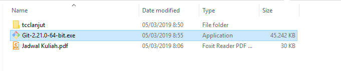
1. Double click pada file yang di-download. Akan dimunculkan lisensi. Klik **Next** untuk lanjut.
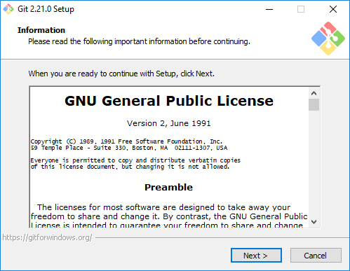
2. Double klik aplikasi Git, Akan mucul gambar dibawah ini, pilih default saja dan klik next.
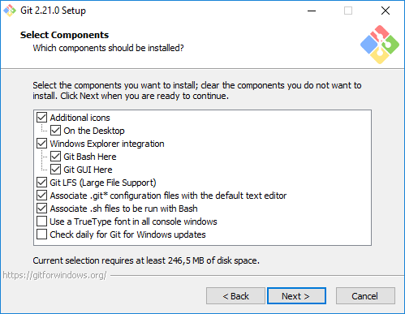
3. Pilih editor yang akan digunakan, pilih notepad++ **Next** untuk lanjut.
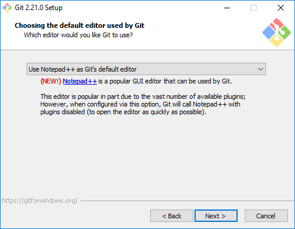
4. Pada saat instalasi, Git menyediakan akses git melalui Bash maupun command prompt. Pilih pilihan kedua supaya bisa menggunakan dari dua antarmuka tersebut. Bash adalah shell di Linux. Dengan menggunakan bash di Windows, pekerjaan di command line Windows bisa dilakukan menggunakan bash - termasuk ekskusi dari Git.
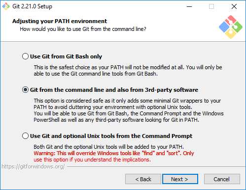
5. Pilih OpenSSL untuk HTTPS. Git menggunakan https untuk akes ke repo GitHub atau repo-repo lain.
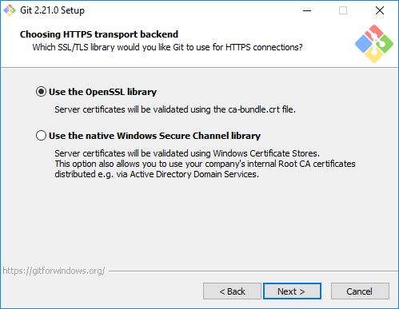
6. Pilih pilihan pertama untuk konversi akhir baris (CR-LF).
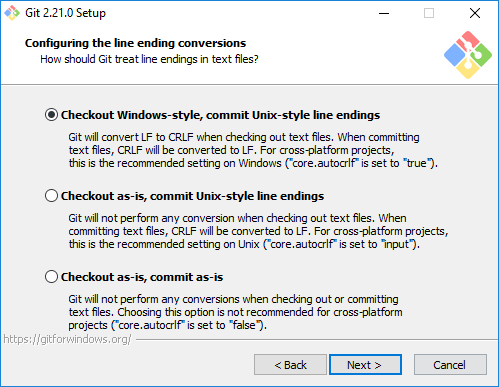
7. Pilih PuTTY untuk terminal yang digunakan untuk mengakses Git Bash.
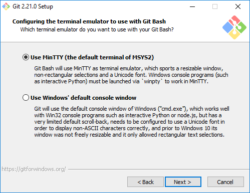
8. Untuk opsi ekstra, pilih serta aktifkan 1 dan 2.
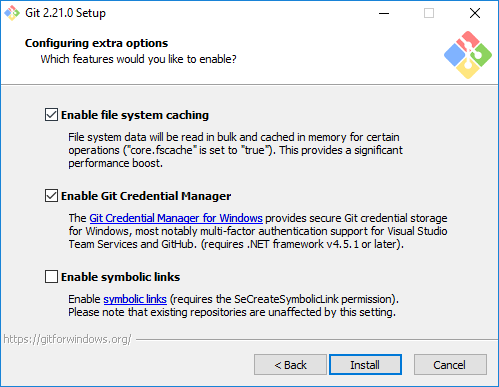
9. Tunggu proses instalasi.
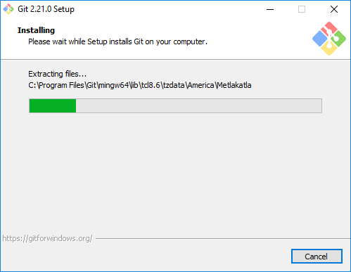
10. Instalasi Berhasil.
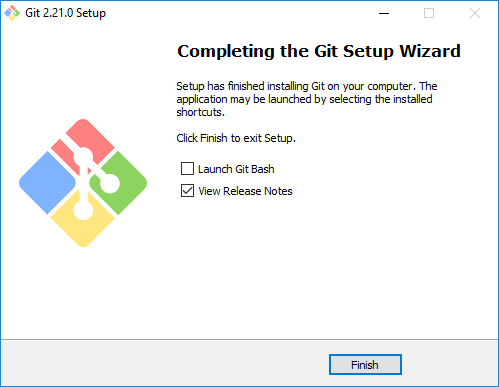