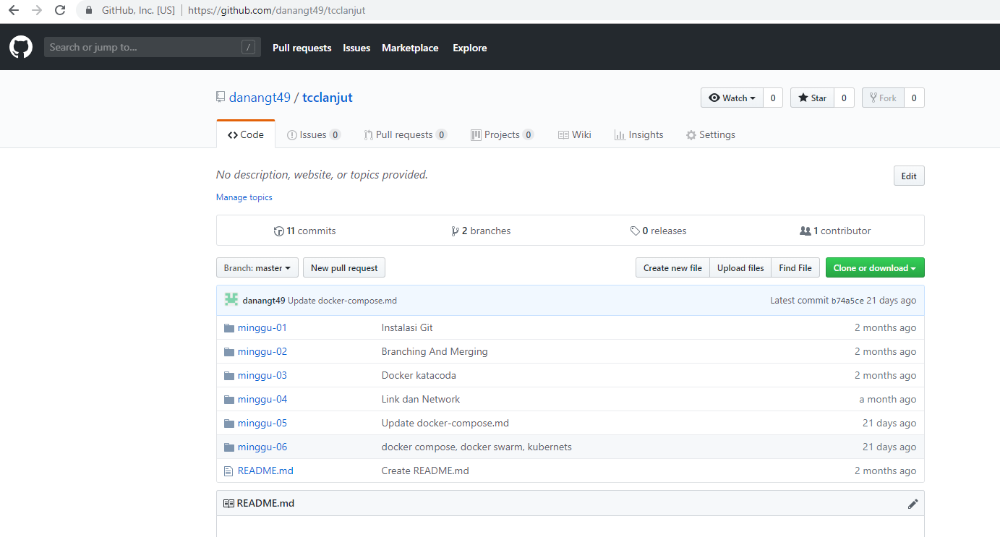
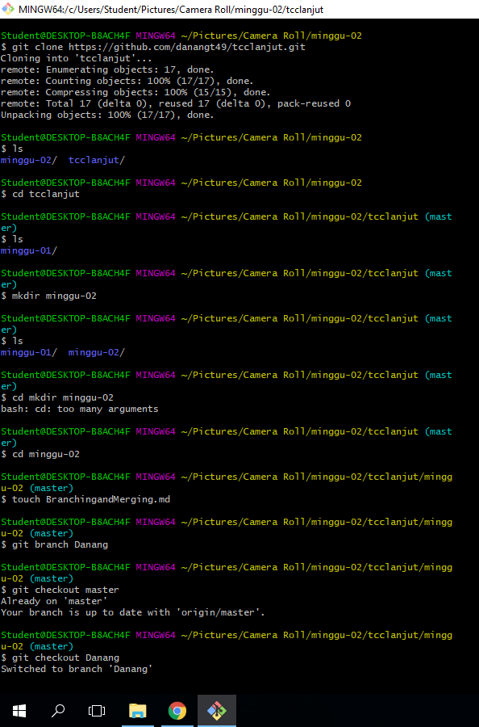
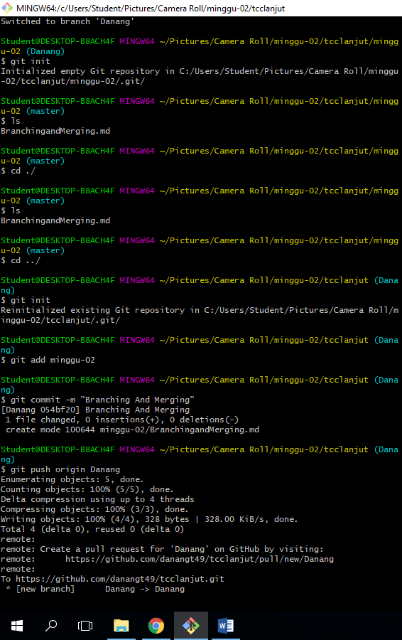

# Branching dan Merging pada Github
## Disini akan melakukan branching pada alamat repo https://github.com/danangt49/tcclanjut

1. lakukan download atau clone pada repo https://github.com/danangt49/tcclanjut

- lakukan ls untuk melihat isi dari hasil clone repo
- masuk ke direktory tcclanjut menggunakan perintah cd tcclanjut dan buat sebuah direktory minggu-02 dengan perintah mkdir.
- lakukan ls untuk melihat isi dari directory tcclanjut
- kemudian masuk ke directory minggu-02 dan buat sebuah file dengan nama BranchingandMerging.md
- buat sebuah branch dengan perintah git branch Danang
- dikarenakan kita sudah buat branch maka kita masuk ke branch dengan perintah git checkout Danang
2. kemudian lakukan langkah dibawah ini

- keluar dari directory minggu-02 dengan perintah cd ../
- lakukan git init untuk membuat repo di lokal
- lakukan perintah penambahan file dengan perintah git add minggu-02
- lakukan commit atau penamaaan sebuah git
- lakukan sebuah push dari Danang ke master dengan perintah git push origin Danang
3. jika sudah maka akan ada tampilan di repo jika ada data yang perlu diverifeied
4. lakukan pull dan commit.
