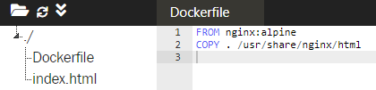
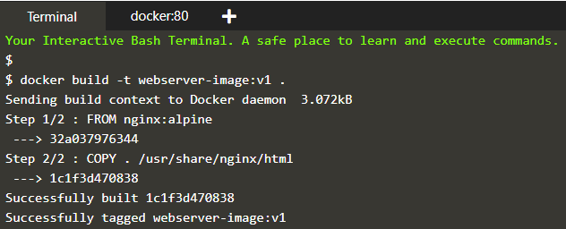
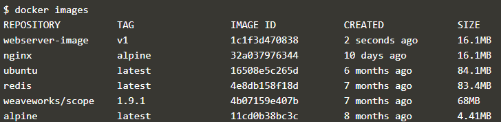
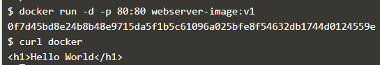
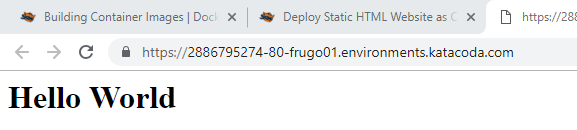

# Create nginx static web server
##Langkah-langkah mendeploy container pertama kalinya menggunakan katacoda
1. Masuk ke alamat https://www.katacoda.com/courses/docker/create-nginx-static-web-server
2. Buat file Dockerfile, dimana akan mengambil image nginx berbentuk alpine yang kemudian dicopykan ke directory /usr/share/nginx/html

3. perintah membuat atau membangun docker image dengan isian yang diambil dari Dockerfile dengan nama webserver-image:v1.

4. Docker images digunakan untuk melihat images yang ada.

5. perintah menjalankan docker pada port 80:80 dengan nama webserver-image:v1.

6. curl docker digunakan untuk melihat isi dari index.html

7. Copy alamat yang telah ada dalam docker dan jalankan di tab lain, jika muncul kalimat hello world berarti berhasil anda membuat web webserver.

##BY : Danang Triyatno (165410058)
