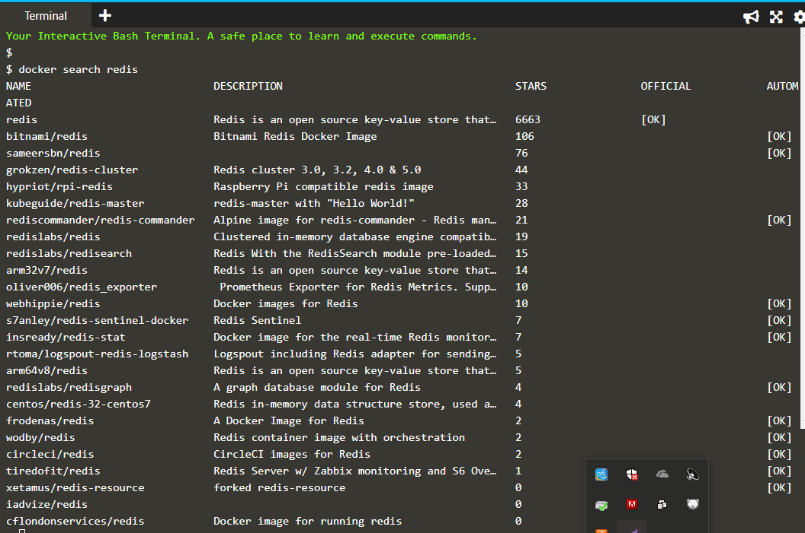
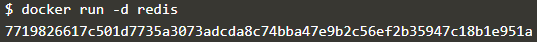
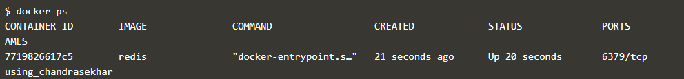
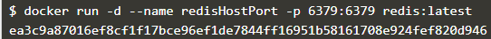
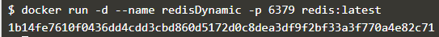
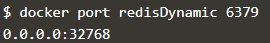
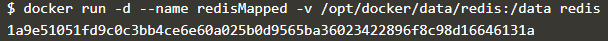
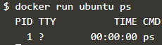
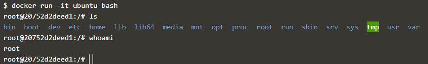

#deploying first container
##Langkah-langkah mendeploy container pertama kalinya menggunakan katacoda
1. Masuk ke alamat https://www.katacoda.com/courses/docker/deploying-first-container
2. Cari image redis atau sebuah image database noSql, dimana sudah banyak yang diinstal dan akan dilakukan update version.

3. Jalankan image redis dengan -d digunakan untuk default yang menggunakan versi baru.

4. Docker ps digunakan untuk melihat image yang kita buat.

5. Lakukan perintah untuk menjalankan docker dengan nama redisHostPort di port 6379 dengan versi docker yang sudah ada.

6. Lakukan perintah untuk menjalankan docker dengan nama redisDynamic di port 6379 dengan versi docker yang sudah ada.

7. Menjalankan redisDynamic pada port 6379.

8. Menjalankan perintah redisMapped yang digunakan untuk menaruh file redisMapped pada folder /opt/docker/data/redis:/data redis.

9. Jalankan perintah dibawah ini yang digunakan untuk melihat image yang ada dalam ubuntu

10. Masuk ke bash ubutntu dengan perintah dibawah ini, ls digunakan untuk melihat isi directory dan whoami digunakan untuk mengetahui user yang aktif.

11. Selesai anda berhasil membuat sebuah container.

##BY : Danang Triyatno (165410058)
