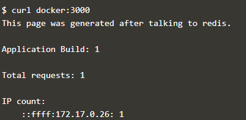

# Membuat cara berkomunikasi atau mengabungkan container satu dengan container lain.
## Langkah-langkah berkomunikasi atau mengabungkan container satu dengan container lain menggunakan image redis atau database.
1. Masuk ke alamat https://www.katacoda.com/courses/docker/5
2. Masukkan perintah menjalankan server redis  bersifat default dan akan muncul alamat atau nama container dibawahnya.
	
3. Membuat sebuah link untuk mengabungkan redis server dengan redis alpine beserta environmentnya.
	
4. Melakukan perintah menghubungkan redis server dengan redis alpine dengan menampilkan file dari directory /etc/hosts.

5. Melakukan perintah menghubungkan redis server dengan redis alpine dengan dan melakukan ping lebih dari 1 pada redis.

6. Perintah menjalankan docker dengan konfigurasi default menggunakan port 8080 yang menghubungkan redis server dengan redis yang terdapat pada katacoda/redis-node-example

7. Membuat sebuah library yang digunakan untuk membuat HTTP Request di browser dalam docker dengan menggunakan port 3000

8. perintah menjalankan redis secara cli di dalam docker, dimana terdapat 2 pilihan yaitu requests dan ip.

9. perintah keluar dari redis cli menggunakan QUIT.

10. Penggabungan container telah berhasil.
