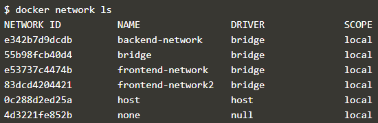

# Menggabungkan container dengan menggunakan network.
## Langkah-langkah menghubungkan container dengan menggunakan network.
1. Masuk ke alamat https://www.katacoda.com/courses/docker/networking-intro
2. Buat sebuah network dengan nama backend-network.

3. menjalankan docker secara default dengan nama redis yang kemudian dijalankan pada backend-network pada image redis.

4. menjalankan pada backend-network dengan melihat isi image alpine environmentnya.

5. Melakukan perintah menjalankan pada backend-network alpine dengan menampilkan file dari directory /etc/hosts. Dimana akan menampilkan informasi yang ada dalam hosts.

6. Melakukan perintah menjalankan pada backend-network alpine dengan menampilkan file dari directory /etc/resolv.conf. Dimana akan menampilkan informasi yang ada dalam hosts.

7. Melakukan perintah menjalankan pada backend-network alpine dengan melakukan ping lebih dari 1 ke redis.

8. Buat sebuah network dengan nama frontend-network.

9. Perintah menjalankan docker dengan konfigurasi default menggunakan port 3000 yang menghubungkan dengan frontend-network yang terdapat pada katacoda/redis-node-example

10. Membuat sebuah library yang digunakan untuk membuat HTTP Request di browser dalam docker dengan menggunakan port 3000

11. Buat sebuah network dengan nama frontend-network2.

12. perintah mengabungkan network dengan menggunakan alias db pada frontend-network2 pada redis dan kemudian menjalankannya pada network frontend-network2 pada alpine yang melakukan ping pada db.

13. perintah menampilkan network yang kita buat.

14. perintah menampilkan isi network yang kita buat.

13. perintah menghentikan network pada frontend-network di redis.

