# Mendeploy Aplikasi dengan menggunakan docker swarm
## langkah pertama buat account di katacoda dan masuk ke https://www.katacoda.com/courses/docker/getting-started-with-swarm-mode 
1. lakukan perintah docker swarm --help yang digunakan untuk melihat perintah apa saja yang terdapat di docker swarm.
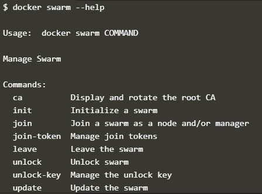
2. Lakukan perintah docker swarn init atau menginisialisai agar dapat terbaca oleh docker swarm pada host 1.
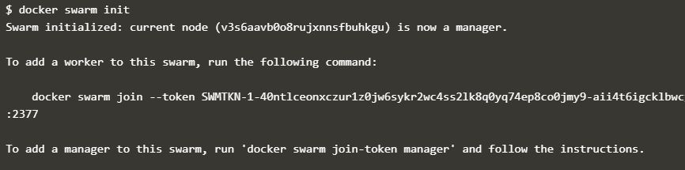
3. lakukan perintah menampilkan token yang nantinya digunakan untuk bergabung dalam docker swarm pada host 2.
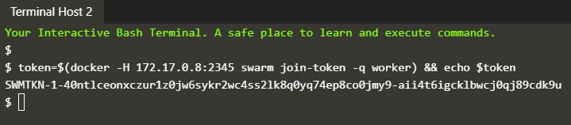
4. perintah untuk melakukan join pada docker swarm di host 1
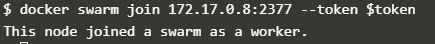
5. lakukan perintah untuk melihat node yang sudah dibuat
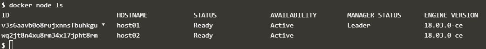 
6. perintah untuk membuat sebuah network menggunakan overly skynet.
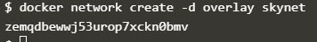
7. perintah untuk membuat sebuah network menggunakan overly skynet dengan membuat 2 buah pada port 80:80
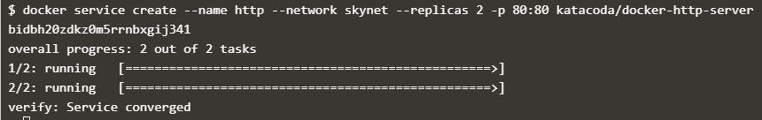
8. Lakukan pengecekan dengan membuka view http port 80.
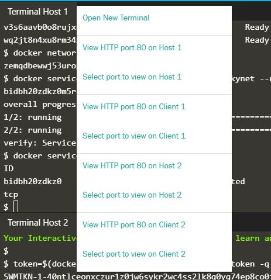

Masukan port 8080 dan muncul tampilan seperti ini
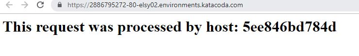
9.  perintah menampilkan service pada docker dan perintah menampilkan container yang aktif
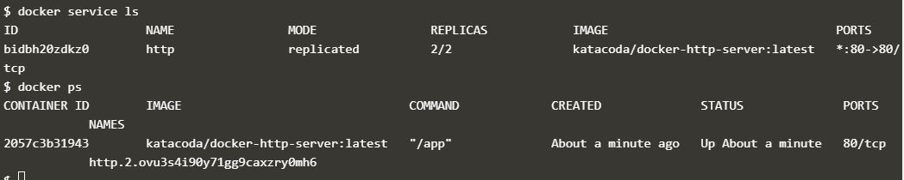
10. curl docker digunakan untuk menampilkan isi yang ada dalam docker berupa html.
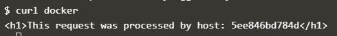
11. perintah menampilkan service yang berjalan pada http
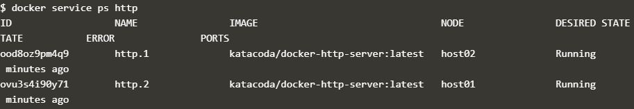
12. perintah menampilkan secara menyeluruh mengenai informasi di service http.
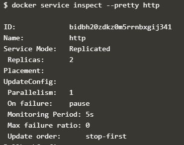
13. perintah menampilkan node yang aktif secara mandiri dan menampilkan node aktif dengan ketentuan $(docker node ls -q | head -n1) serta menampilkan isi yang ada dalam docker berupa html.
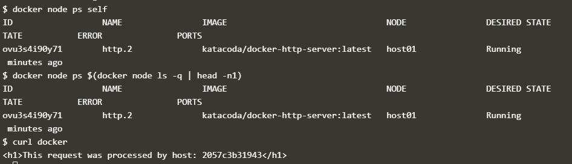
14. perintah membuat service http berjumlah 5 buah.
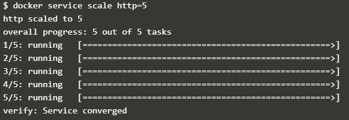
15. perintah menampilkan docker yang aktif.
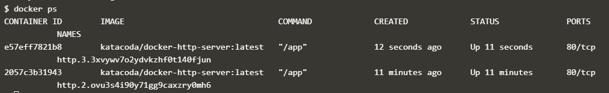

curl docker digunakan untuk menampilkan isi yang ada dalam docker berupa html.
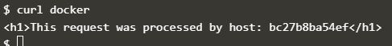

 Lakukan pengecekan dengan membuka view http port 80.
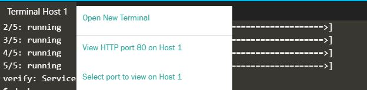

Masukan port 8080 dan muncul tampilan seperti ini

