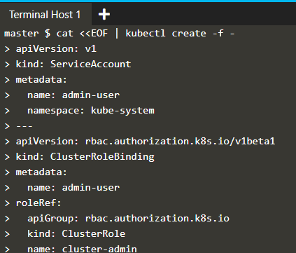

# Melakukan clustering menggunakan kubernets.
## Buat account di katacoda dan masuk ke https://www.katacoda.com/courses/kubernetes/getting-started-with-kubeadm
1. Lakukan perintah inisialisasi pada kubeadm.

2. Lakukan perintah join menggunakan token kubeadm pada host 1.

3. melakukan verifiaksi join yang dilakukan kubeadm pada host 2.
 
4. perintah mengambil sebuah nodes.

5.  perintah menampilkan isi dari file menggunakan cat pada file /opt/weave-kube.

6. perintah menyetujui isi dari file /opt/weave-kube dan perintah mengambil sebuah pod pada kube-system.

7. perintah membuat deployment pada service http yang mengambil image katacoda/docker-http-server:latest dan melakukan pengambilan sebuah pods.

8. perintah meliha container yang aktif dengan kata kunci docker-http-server.

9. perintah menampilkan isi pada <<EOF | kubectl cretae -f -

10. perintah untuk melihat descripsi pada kubernets.
